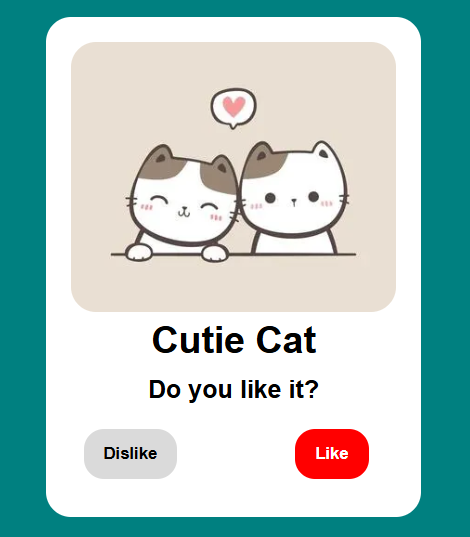
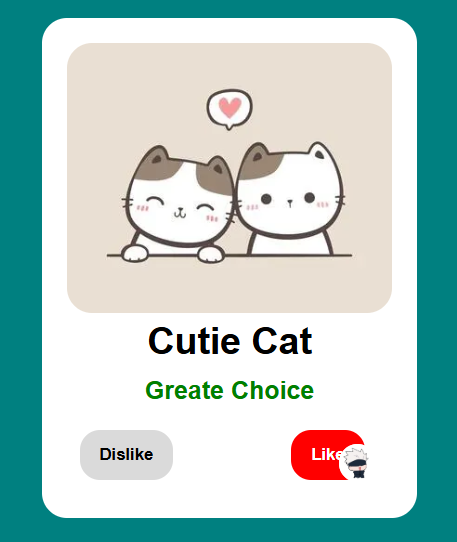

# 🐱 Purrfect Choice

A small interactive cat card built while practicing **JavaScript DOM manipulation**.

Click around, make your choice, and double-click the cat for a little surprise. ❤️

## ✨ Features

* 👍 Like / Dislike interaction
* 🎨 Dynamic text and color changes
* ❤️ Double-click heart animation
* 🖱️ Custom Gojo cursor
* ⚡ Mouse and click event handling

## 🛠️ Built With

* HTML
* CSS
* JavaScript
* Remix Icon

## 🎯 What I Practiced

* `querySelector()`
* `addEventListener()`
* Click & double-click events
* Mouse movement events
* Changing `innerHTML`
* Dynamic CSS manipulation
* `setTimeout()`

## 📸 Preview





## 🚀 Run Locally

```bash
git clone https://github.com/ChiragJoshi-ai/DOM-Practice.git
```

Open `index.html` in your browser and you're good to go.

---

Made while learning the DOM 🐾
